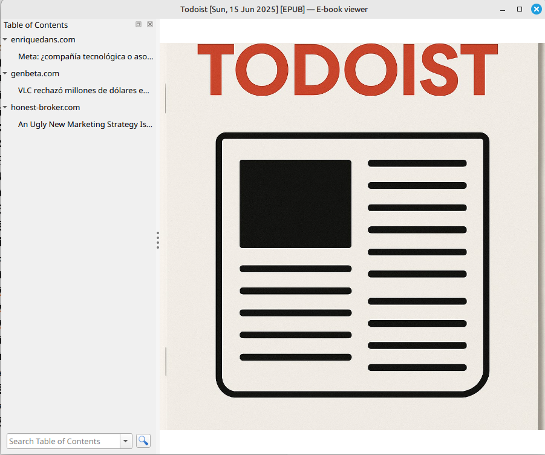
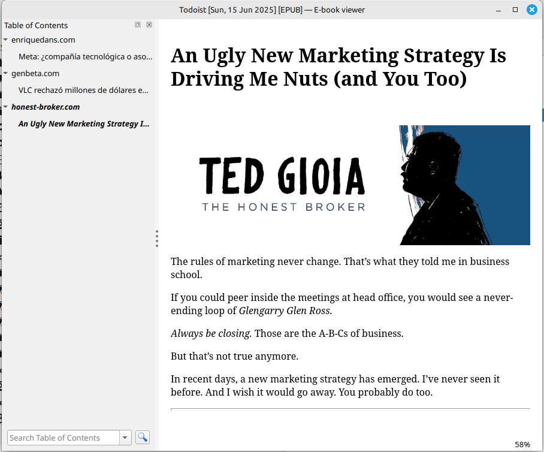

# todoist2ebook

Simple python script and calibre recipe to build an epub with your saved articles in todoist and send it to an email address.






## Usage (standalone, recommended)

- Clone the project
- Create a venv ```python3 -m venv .venv```
- Activate it ```source .venv/bin/activate```
- Install dotenv ```pip3 install python-dotenv```
- Copy .env.sample to .env and populate values
- Either copy vars.py.sample to vars.py your home folder and populate values, or modify the variables in Todoist.recipe
- Run the script ```(.venv) ~/todoist2ebook$ python3 main.py```

## Recipe parameters (in var.py or in Todoist.recipe)

- URL_KEYWORD_EXCEPTIONS = keywords in an URL that will result in it's exclusion
- ARCHIVE_DOWNLOADED = True | False => Should the script close the tasks after retrieving the urls

- TODOIST_PROJECT_ID => Todoist project where the URLs will be recovered
- TODOIST_API_KEY => Your api KEY

## Main.py parameters (.env)

- SEND_EMAIL=True | False => Should the script send the email?
- SMTP_* => Your server credentials
- DESTINATION_EMAIL => Where should the script send the epub

## Output

You should see something like:

```
2025-06-15 17:11:05,958 -  INFO-  Start
2025-06-15 17:11:05,959 -  INFO-  File name: todoist-15-06-2025.epub
Conversion options changed from defaults:
  test: None
1% Converting input to HTML...
InputFormatPlugin: Recipe Input running
Using custom recipe
Using user agent: Mozilla/5.0 (Windows NT 10.0; Win64; x64) AppleWebKit/537.36 (KHTML, like Gecko) Chrome/131.0.0.0 Safari/537.36
1% Fetching feeds...
Ignoring article due to keyword patterns:https://XXXXXXX
Adding article: https://www.enriquedans.com/2025/06/meta-compania-tecnologica-o-asociacion-de-malhechores.html to section: enriquedans.com
Adding article: https://www.genbeta.com/a-fondo/dinero-carcel-responsable-vlc-explica-que-siempre-sera-gratis-anuncios to section: genbeta.com
Adding article: https://www.honest-broker.com/p/an-ugly-new-marketing-strategy-is to section: honest-broker.com
1% Got feeds from index page
1% Trying to download cover...
34% Downloading cover from https://raw.githubusercontent.com/alvaroreig/todoist2ebook/master/img/todoist-cover.png
1% Generating masthead...
34% Masthead image downloaded
1% Starting download [10 threads]...
12% Article downloaded: VLC rechazó millones de dólares en publicidad: su responsable explica por qué siempre será gratis y sin anuncios
23% Article downloaded: An Ugly New Marketing Strategy Is Driving Me Nuts (and You Too)
34% Article downloaded: Meta: ¿compañía tecnológica o asociación de malhechores?
34% Feeds downloaded to /tmp/calibre-43oq_w_u/5nmadbbf_plumber/index.html
34% Download finished
Task 9258921684 corectly closed.
Task 9258925497 corectly closed.
Task 9258446866 corectly closed.
Parsing all content...
Forcing feed_0/article_0/index.html into XHTML namespace
Forcing feed_1/article_0/index.html into XHTML namespace
Forcing feed_2/article_0/index.html into XHTML namespace
Forcing index.html into XHTML namespace
Referenced file 'feed_3/index.html' not found
34% Running transforms on e-book...
Merging user specified metadata...
Detecting structure...
Flattening CSS and remapping font sizes...
Source base font size is 12.00000pt
Removing fake margins...
Cleaning up manifest...
Trimming unused files from manifest...
Creating EPUB Output...
67% Running EPUB Output plugin
Found non-unique filenames, renaming to support broken EPUB readers like FBReader, Aldiko and Stanza...
Splitting markup on page breaks and flow limits, if any...
	Looking for large trees in feed_0/index.html...
	No large trees found
	Looking for large trees in feed_0/article_0/index_u1.html...
	No large trees found
	Looking for large trees in feed_1/index_u2.html...
	No large trees found
	Looking for large trees in feed_1/article_0/index_u3.html...
	No large trees found
	Looking for large trees in feed_2/index_u4.html...
	No large trees found
	Looking for large trees in feed_2/article_0/index_u5.html...
	No large trees found
	Looking for large trees in index_u6.html...
	No large trees found
The cover image has an id != "cover". Renaming to work around bug in Nook Color
EPUB output written to /home/xxxx/todoist2ebook/todoist-15-06-2025.epub
Output saved to   /home/xxxx/todoist2ebook/todoist-15-06-2025.epub
2025-06-15 17:11:11,884 -  INFO-  Sending email to: xxxxxxx@kindle.com
2025-06-15 17:11:16,588 -  INFO-  End
```

## Usage with Docker (experimental)

- Download the docker/env.local.sample to env.local and populate values
- In the same folder where env.local is, run ```docker run --rm -v "$PWD/env.local:/home/appuser/env.local" rga5321/todoist2ebook-arm64:latest``` or ```docker run --rm -v "$PWD/env.local:/home/appuser/env.local" rga5321/todoist2ebook-amd64:latest``` depending on your architecture


